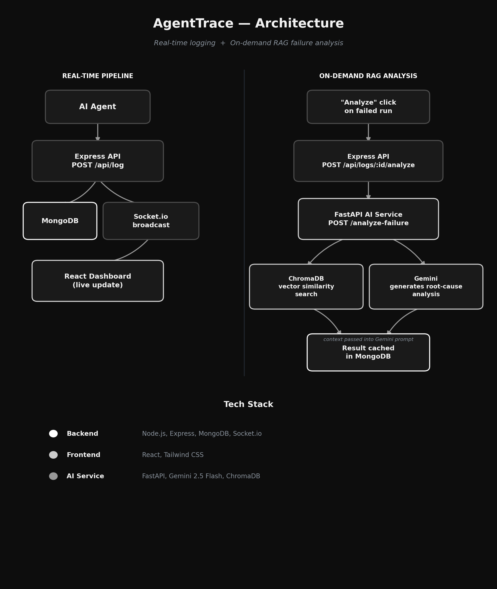

# AgentTrace

AgentTrace is a real-time monitoring dashboard for AI agents. It logs every action an agent takes and shows successes and failures live on a dashboard. When something fails, you can click "Analyze" to see the likely root cause — using a RAG pipeline that retrieves similar past failures and uses them as context to detect recurring patterns.

## Key Features

### Real-Time Observability
- **Live dashboard** — agent runs appear instantly via WebSockets, no refresh needed
- **Full run history** — agent ID, action, cost, latency, success/failure, timestamp
- **Persistent storage** — every run is logged to MongoDB

###  RAG-Powered Failure Analysis
- **On-demand analysis** — click "Analyze" on any failed run, no automatic LLM calls on every failure
- **Vector similarity retrieval** — failures are embedded and stored in ChromaDB; new failures are compared against past ones
- **Context-aware generation** — Gemini generates its explanation using retrieved similar failures as context, so it can flag recurring patterns instead of analyzing each failure in isolation
- **Cached results** — once a run is analyzed, the result is cached in MongoDB so it's not regenerated on every click

## Architecture

```
Agent
  │
  ▼
Express API (/api/log) ──────► MongoDB
  │
  ▼
Socket.io broadcast ──────► React Dashboard (live update)


Dashboard "Analyze" click
  │
  ▼
Express API (/api/logs/:id/analyze)
  │
  ▼
FastAPI AI Service (/analyze-failure)
  │
  ├──► ChromaDB: vector similarity search
  │        (finds similar past failures)
  │
  └──► Gemini: generates root-cause analysis
           using retrieved failures as context
  │
  ▼
Result cached back in MongoDB
```



## Tech Stack

**Backend**
- Node.js + Express
- MongoDB + Mongoose
- Socket.io (real-time updates)

**Frontend**
- React
- Tailwind CSS
- Socket.io client

**AI Service**
- Python + FastAPI
- Google Gemini (`gemini-2.5-flash`) for failure analysis
- ChromaDB (vector database) for similarity search / RAG retrieval

##  Project Structure

```
AgentTrace/
├── backend/                # Express API + MongoDB
│   ├── models/
│   │   └── AgentRun.js     # Run schema (agentId, action, cost, etc.)
│   ├── Routes/
│   │   └── logRoutes.js    # /api/log, /api/logs, /api/logs/:id/analyze
│   └── server.js
│
├── frontend/                # React dashboard
│   └── src/
│       ├── App.js          # Live dashboard + Analyze UI
│       └── index.css
│
├── ai-service/               # FastAPI + Gemini + ChromaDB
│   ├── main.py              # /analyze-failure endpoint, RAG pipeline
│   └── chroma_data/          # Persisted vector store (gitignored)
│
├── demo-agent/                # Sample agent for generating test runs
│   └── agent.js
│
└── README.md
```

##  Getting Started

### Prerequisites

- Node.js (v18+)
- Python (3.10+)
- MongoDB (local or Atlas)
- A Google Gemini API key ([get one here](https://aistudio.google.com/app/apikey))

### 1. Clone the repo

```bash
git clone https://github.com/suryapratapsingh26/AgentTrace.git
cd AgentTrace
```

### 2. Backend setup

```bash
cd backend
npm install
```

Create a `.env` file in `backend/`:

```
MONGO_URI=your_mongodb_connection_string
PORT=5000
```

Run it:

```bash
node server.js
```

### 3. Frontend setup

```bash
cd frontend
npm install
npm start
```

Dashboard runs at `http://localhost:3000`.

### 4. AI service setup

```bash
cd ai-service
python -m venv venv
venv\Scripts\activate      # Windows
# source venv/bin/activate   # macOS/Linux

pip install fastapi uvicorn chromadb python-dotenv google-generativeai
```

Create a `.env` file in `ai-service/`:

```
GEMINI_API_KEY=your_gemini_api_key
```

Run it:

```bash
uvicorn main:app --reload --port 8000
```

### 5. Try it out

- Run the demo agent (`demo-agent/agent.js`) to generate sample runs
- Watch them appear live on the dashboard at `http://localhost:3000`
- Click **Analyze** on any failed run to see the AI-generated root cause analysis

## 📖 API Reference

**Backend** (`http://localhost:5000`)

| Method | Endpoint | Description |
|---|---|---|
| POST | `/api/log` | Log a new agent run |
| GET | `/api/logs` | Get recent runs (last 100) |
| POST | `/api/logs/:id/analyze` | Trigger AI analysis on a failed run |

**AI Service** (`http://localhost:8000`)

| Method | Endpoint | Description |
|---|---|---|
| POST | `/analyze-failure` | Analyze a failure using RAG over past failures |

Interactive API docs available at `http://localhost:8000/docs`.

## 🔭 Future Improvements

- Filter/search runs by agent, action, or status
- Analytics charts (failure rate over time, cost trends)
- Hybrid retrieval (filter by action type before vector search)
- Migrate from deprecated `google-generativeai` to `google-genai`
- Deployment (Docker + cloud hosting)